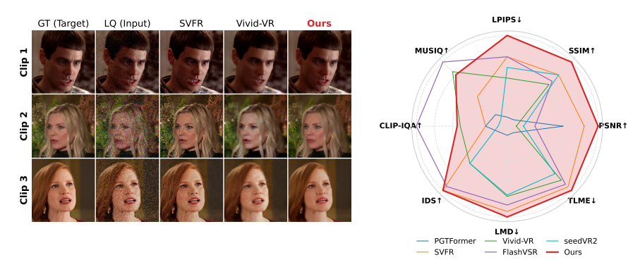
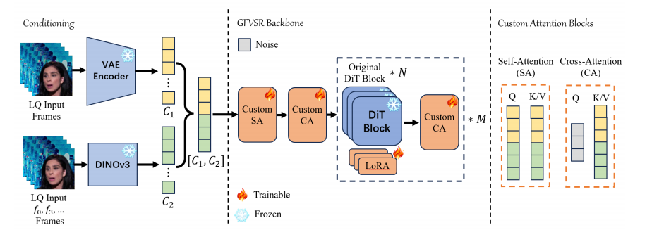
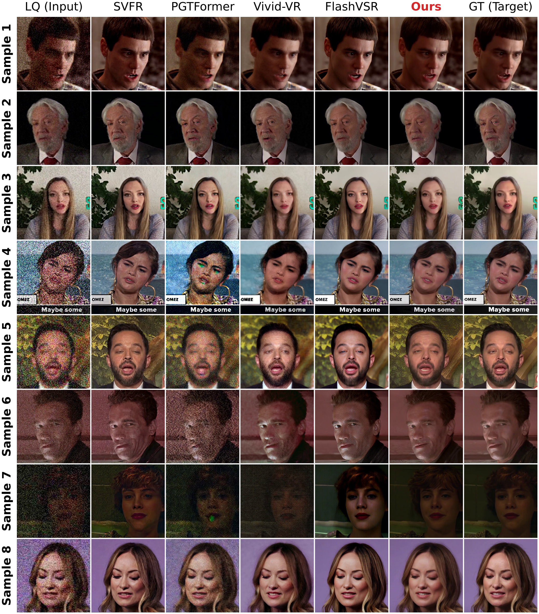
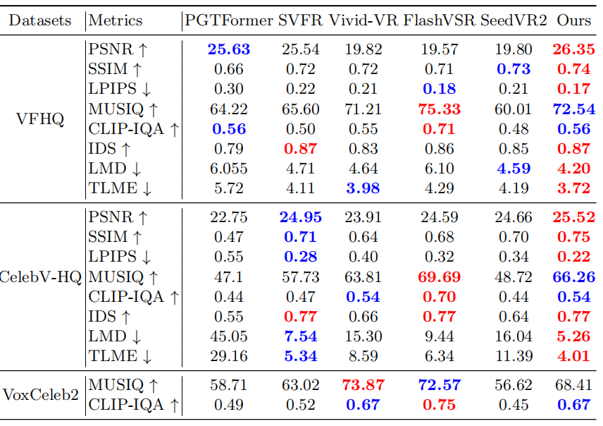

<div align="center">

<h1>DTI: Dynamic Trajectory Initialization for Generative Face Video Super-Resolution</h1>

<div>
    Yingwei Tang,&emsp;
    Chen Yan,&emsp;
    Wendi Liu,&emsp;
    Qiang Hu<sup>*</sup>,&emsp;
    Xiaoyun Zhang
</div>

<div>
    Cooperative Medianet Innovation Center, Shanghai Jiao Tong University, Shanghai, China
</div>

<div>
    <sup>*</sup> Corresponding author
</div>

<div>
    <b>ECCV 2026</b>
</div>

<br>

<a href="https://arxiv.org/abs/2606.29198" target="_blank">Paper</a> |
<a href="https://github.com/MediaX-SJTU/DTI" target="_blank">Code</a> |
<a href="https://huggingface.co/sdhsk/DTI" target="_blank">Models</a>

<br><br>

<div align="center">
  
</div>

</div>

---

## 🔥 Updates

- **[2026.06.28]** The paper is available on [arXiv](https://arxiv.org/abs/2606.29198).
- Inference code is released.
- Training code and detailed training instructions are **coming soon**.

## 🎬 Overview

**DTI** is a generative face video super-resolution framework that reformulates restoration from **full generation** into **input-driven directional restoration**.

Instead of always starting diffusion sampling from pure Gaussian noise, DTI estimates a suitable intermediate point on the diffusion trajectory according to the degradation level of the low-quality input. The framework further enhances the restoration condition with visual features extracted from **DINOv3** and introduces a lightweight **Discriminative Guide (DG)** for dynamic trajectory initialization.

Main features:

- **Dynamic Trajectory Initialization.** Start generative restoration from an input-adaptive point on the diffusion trajectory instead of always sampling from pure noise.
- **Enhanced visual conditioning.** Combine low-quality video latents with fine-grained DINOv3 visual features and inject them into the DiT backbone through customized attention blocks.
- **Discriminative Guide (DG).** Predict the degradation-aware starting point and a coarse low-frequency refinement for efficient restoration.
- **Controllable perception-distortion trade-off.** Adjust the restoration behavior with the perception ratio parameter during DG-guided inference.
- **Efficient generative restoration.** DG-guided dynamic initialization can substantially reduce the number of denoising steps compared with full-trajectory sampling.

<div align="center">
  
</div>

## 🧩 Method

DTI is built on the **Wan2.1-T2V-1.3B** DiT backbone. Given a low-quality face video, the method uses the Wan VAE latent together with DINOv3 visual features as restoration conditions. The restoration model performs conditional generative refinement, while the optional DG module estimates a degradation-aware starting point for the diffusion trajectory.

The repository provides two inference modes:

| Script | DG | Initialization | Description |
| --- | --- | --- | --- |
| [`inference.py`](./inference.py) | ✗ | Full trajectory | Standard DTI inference without the DG module. |
| [`infer_dp.py`](./infer_dp.py) | ✓ | Dynamic | DTI inference with DG-based dynamic trajectory initialization. |

<div align="center">
  
</div>

## 🔧 Dependencies and Installation

### 1. Clone the repository

```bash
git clone https://github.com/MediaX-SJTU/DTI.git
cd DTI
```

### 2. Environment setup

DTI is based on **Wan2.1-T2V-1.3B**. Please follow the official [Wan2.1 installation / Quickstart](https://github.com/Wan-Video/Wan2.1#quickstart) to prepare the environment.

### 3. Model preparation

The following pretrained models / checkpoints are required:

- **Wan2.1-T2V-1.3B**: [Hugging Face](https://huggingface.co/Wan-AI/Wan2.1-T2V-1.3B)
- **DINOv3 ViT-H+/16** (`facebook/dinov3-vith16plus-pretrain-lvd1689m`): [ModelScope](https://modelscope.cn/models/facebook/dinov3-vith16plus-pretrain-lvd1689m) / [Hugging Face](https://huggingface.co/facebook/dinov3-vith16plus-pretrain-lvd1689m)
- **DTI checkpoints** (restoration model, DG, and auxiliary files such as `context_null.pt`): [Hugging Face](https://huggingface.co/sdhsk/DTI)

> [!NOTE]
> The current inference scripts load checkpoints from paths configured inside `inference.py` and `infer_dp.py`. Before running inference, please update the Wan2.1 checkpoint path, DTI checkpoint path, DG checkpoint path (for `infer_dp.py`), and `context_null.pt` path to your local locations.

## 🚀 Training

Training code and detailed instructions are **coming soon**.

## ☕ Quick Inference

The inference scripts process a **single low-quality video** at a time. Spatial sizes that are not divisible by 16 and frame counts that do not satisfy `4N+1` are padded automatically before inference and cropped back to the original size afterward.

### 1. Inference without DG

Use [`inference.py`](./inference.py) for standard DTI inference without dynamic guidance:

```bash
python inference.py \
    --input ./examples/input/lq_video.mp4 \
    --output ./results/dti_wo_dg.mp4 \
    --sampling_steps 50 \
    --shift 5.0 \
    --fps 6 \
    --seed 2025
```

Key arguments:

- `--input`, `-i`: path to the low-quality input video.
- `--output`, `-o`: path to the restored output video.
- `--sampling_steps`: number of diffusion sampling steps. Default: `50`.
- `--shift`: flow-matching scheduler shift. Default: `5.0`.
- `--fps`: output video FPS. Default: `6`.
- `--seed`: random seed. Default: `2025`.

### 2. Inference with DG

Use [`infer_dp.py`](./infer_dp.py) to enable the **Discriminative Guide (DG)** and dynamic trajectory initialization:

```bash
python infer_dp.py \
    --input ./examples/input/lq_video.mp4 \
    --output ./results/dti_with_dg.mp4 \
    --perception_ratio 0.0 \
    --sampling_steps 50 \
    --shift 5.0 \
    --fps 6 \
    --seed 2025
```

Key arguments:

- `--input`, `-i`: path to the low-quality input video.
- `--output`, `-o`: path to the restored output video.
- `--perception_ratio`, `-p`: controls the perception-distortion trade-off, in the range `[0, 1]`. Lower values favor fidelity, while higher values move the starting point toward a noisier state and favor perceptual quality. Default: `0.5`.
- `--sampling_steps`: maximum diffusion schedule length. The actual number of evaluated steps is dynamically determined by the predicted starting point. Default: `50`.
- `--shift`: flow-matching scheduler shift. Default: `5.0`.
- `--fps`: output video FPS. Default: `6`.
- `--seed`: random seed. `-1` uses a random seed. Default: `-1`.

For the fidelity-oriented setting used in the paper's DG evaluation, set:

```bash
--perception_ratio 0.0
```

## 📊 Results

On the VFHQ benchmark, the DG-guided version dynamically shortens the restoration trajectory and reduces the average number of function evaluations from **50 to 12** in the reported setting, while improving full-reference fidelity metrics and shifting the perception-distortion trade-off toward fidelity. Please refer to the [paper](https://arxiv.org/abs/2606.29198) for complete quantitative and qualitative comparisons.

<div align="center">
  
</div>

## 📁 Repository Structure

```text
DTI/
├── inference.py                 # Inference without DG
├── infer_dp.py                  # Inference with DG
├── fm_solvers_unipc_new.py      # Scheduler used by dynamic initialization
├── FlowIntegralScheduler.py
├── common.py
├── data.py
├── utils.py
├── requirements.txt
└── wan/                         # Wan2.1-based model implementation
```

## 📧 Citation

If you find this project useful for your research, please consider citing our paper:

```bibtex
@article{Tang2026DTIDT,
  title={DTI: Dynamic Trajectory Initialization for Generative Face Video Super-Resolution},
  author={Yingwei Tang and Chen Yan and Wending Liu and Qiang Hu and Xiaoyun Zhang},
  journal={ArXiv},
  year={2026},
  volume={abs/2606.29198},
  url={https://api.semanticscholar.org/CorpusID:289683459}
}
```

## 🙏 Acknowledgements

This project is built upon and inspired by several excellent open-source projects, including:

- [Wan2.1](https://github.com/Wan-Video/Wan2.1)
- [DINOv3](https://github.com/facebookresearch/dinov3)
- [Hugging Face Diffusers](https://github.com/huggingface/diffusers)

We thank the authors and contributors for making their work publicly available.
